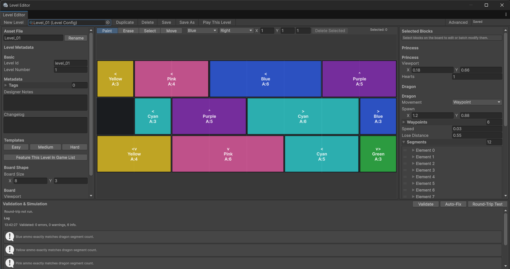
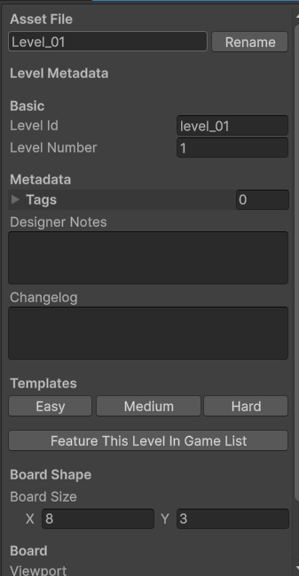
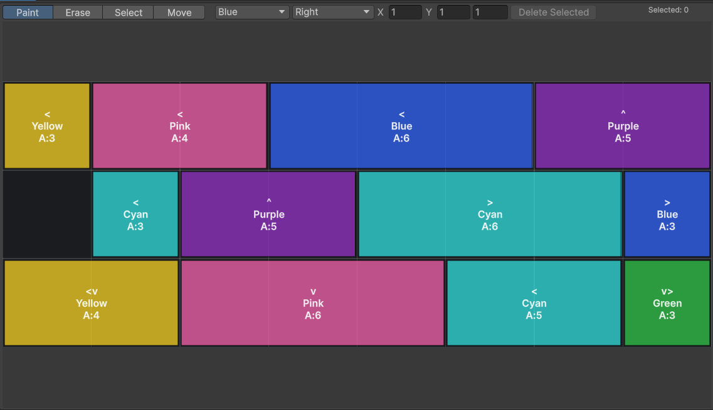
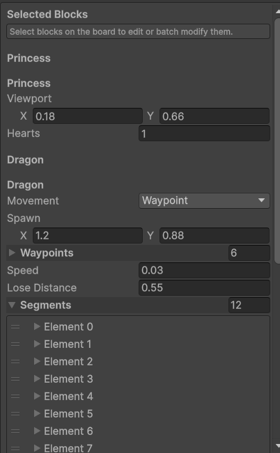
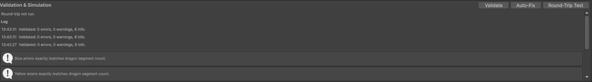
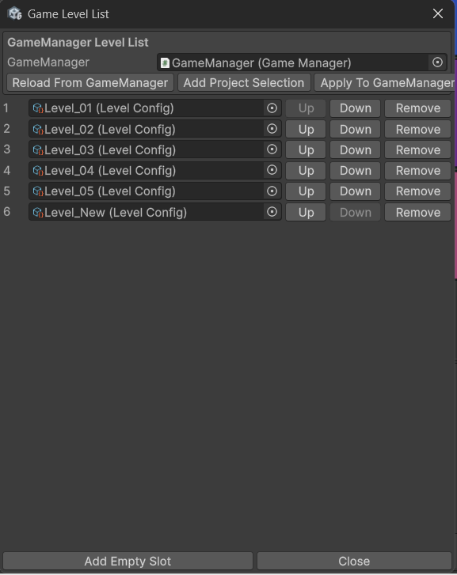

# Girl Rescue

Girl Rescue is a Unity puzzle prototype where players release colored arrow blocks from a board, load cannon slots with matching ammo, and destroy every dragon segment before the dragon reaches the princess.

The project is built around data-driven levels: each level is a `LevelConfig` ScriptableObject, and both the runtime game and the custom Level Editor Tool read and write the same asset data.

## Requirements

- Unity `6000.3.14f1`
- Universal Render Pipeline 2D project setup
- Main scene: `Assets/Scenes/SampleScene.unity`
- Level assets: `Assets/_Project/ScriptableObjects/Levels/`

## How To Open And Run

1. Open Unity Hub.
2. Add this project folder.
3. Open it with Unity `6000.3.14f1`.
4. Open `Assets/Scenes/SampleScene.unity`.
5. Press Unity's Play button.

By default, `GameManager` loads the first entry in its `_allLevels` list. To test a specific level without permanently changing the production list, use `Tools > Level Editor > Play This Level`.

## Architecture Patterns Used

- Entity-Component Pattern:
  - Gameplay objects are split into focused MonoBehaviour components instead of one large class.
  - Examples: board blocks use `BlockIdentity`, `BlockVisual`, and movement/animation helpers; dragon objects use `DragonManager`, movement strategies, segment identity, and segment visuals; projectiles use identity, movement, visual, and hit resolver components.

- Observer Pattern:
  - Systems communicate through events instead of direct hard references wherever possible.
  - `GameEvents` broadcasts events such as level start, game state changes, block spawning, win, and lose.
  - UI, board, dragon, and game-state systems can react without tightly coupling every class together.

- Singleton For Managers:
  - Global manager-style systems inherit from `Singleton<T>` when there should be one active instance.
  - Examples: `GameManager`, `LevelManager`, `PoolManager`, `BoosterManager`, and `SoundManager`.
  - This keeps central orchestration easy to access while the level data itself remains in `LevelConfig` assets.

## Project Structure

- `Assets/_Project/Scripts/Core`
  - `GameManager`: owns game state, level progression, win/lose/retry/next-level flow.
  - `LevelManager`: spawns and clears princess, dragon, board, slot bar, boosters, and projectiles from a `LevelConfig`.
  - `GameEvents`: shared gameplay events used to decouple UI, board, dragon, and game state.
  - `PoolManager`: object pooling for reusable runtime objects such as dragon segments and blocks.
  - `WorldLayout` and `BoardWorldLayout`: convert viewport/grid data into world positions.

- `Assets/_Project/Scripts/Data`
  - `LevelConfig`: single source of truth for level data.
  - `NormalArrowBlockData`: board block data: id, position, size, color, direction, ammo.
  - `DragonSegmentData`: dragon color/count rows.
  - `BoosterData`: per-level booster setup.
  - `Enums`: shared gameplay enums such as `CannonColor`, `Direction`, `DragonMovementType`, and `BoosterType`.
  - `ColorPalette`: central color mapping for cannon colors.

- `Assets/_Project/Scripts/Entities`
  - `Board`: board input, block identity/visuals, escape resolution, movement ownership.
  - `Dragon`: dragon manager, movement strategies, segment identity/visuals.
  - `Cannon`: slot bar and cannon slot behavior.
  - `Projectile`: projectile movement and hit resolution.
  - `Princess`: princess identity marker.

- `Assets/_Project/Scripts/UI`
  - Runtime HUD, progress display, booster bar, result popup, ammo badges, and gameplay prompts.

- `Assets/_Project/Scripts/Booster`
  - `BoosterManager`: runtime booster state and actions.

- `Assets/_Project/Scripts/Editor`
  - `LevelEditorWindow`: custom designer-facing level editor.
  - `LevelConfigEditor`: custom inspector behavior for `LevelConfig`.
  - Setup utilities for UI/editor maintenance.

## Runtime Architecture

The runtime flow is:

1. `GameManager.Start()` selects the current `LevelConfig`.
2. `GameManager.StartLevel()` calls `LevelManager.InitLevel(config)`.
3. `LevelManager` spawns:
   - princess from `princessViewport`;
   - dragon from movement/path/segment data;
   - board from `boardSize`, `boardViewport`, and `blocks`;
   - slot bar from slot/cannon defaults;
   - boosters from `boosters`.
4. `BoardManager` creates board blocks from `NormalArrowBlockData`.
5. Released blocks load cannon slots as ammo.
6. Cannons fire at matching dragon segments.
7. The level is won when all dragon segments are destroyed.
8. The level is lost when the dragon reaches the princess.

The important design point: level content lives in `LevelConfig` assets, not in scene-only objects.

## Level Data Rules

For each level:

- Board ammo must exactly equal dragon segment count.
- This is checked both by total and by color.
- Example: if the dragon has 9 Blue segments, the board must contain exactly 9 Blue ammo.
- No more, no less. Completing the board puzzle should destroy every dragon segment exactly once.

The five existing level assets currently satisfy this rule.

## Level Editor Tool

Open it from:

```text
Tools > Level Editor
```

The Level Editor is designed for non-technical level designers. It lets designers create, edit, validate, save, organize, and playtest `LevelConfig` assets without manually editing scene hierarchy or raw inspector lists.




Capture note: open `Tools > Level Editor`, select a level, and capture the whole window showing the asset bar, metadata panel, board canvas, gameplay panel, and validation log.

### Main Controls

- `New Level`: creates a new `LevelConfig` in `Assets/_Project/ScriptableObjects/Levels/`.
- Object field: selects the active `LevelConfig`.
- `Duplicate`: creates a copy of the current level asset.
- `Delete`: deletes the current level asset after confirmation.
- `Save`: saves the current asset.
- `Save As`: creates a copy at a chosen asset path.
- `Play This Level`: temporarily places the selected level at the top of the scene `GameManager._allLevels`, closes the editor tool, and presses Unity Play. When Play Mode ends, the original level list is restored.
- `Advanced`: shows extra advanced config fields.

### Metadata And Asset Naming

The left panel includes:

- asset file name rename field;
- `levelId`;
- `levelNumber`;
- `tags`;
- `designerNotes`;
- `changelog`.

Metadata is for designer workflow only. Runtime gameplay ignores tags, notes, and changelog.




Capture note: capture the left panel with the `Asset File`, `Level Metadata`, and `Templates` sections visible.

### Templates

The tool includes Easy, Medium, and Hard templates. Applying a template:

- copies Level 1 defaults first;
- preserves the current asset file name and metadata;
- defaults dragon movement to Waypoint;
- fills board data;
- fills dragon segment data;
- fills booster data;
- fills slot/cannon defaults.

### Board Canvas

The center panel is a visual grid editor.

Tools:

- `Paint`: place a block using the selected color, direction, size, and ammo.
- `Erase`: remove a block from the board.
- `Select`: select one or more blocks.
- `Move`: move selected blocks to a target grid cell.

Selected blocks can be edited from the right panel or deleted with:

- `Delete Selected`;
- Delete key;
- Backspace key.




Capture note: capture a level with several colored blocks on the board and one selected block highlighted.

### Gameplay Panel

The right panel edits:

- selected block properties;
- princess viewport and hearts;
- dragon movement, path, speed, segments, and recoil;
- slots and cannon defaults;
- booster list.




### Validation, Auto-Fix, And Round-Trip

The bottom panel includes:

- `Validate`: runs structural and gameplay checks.
- `Auto-Fix`: runs the same auto-normalization rules as `LevelConfig`.
- `Round-Trip Test`: saves and reloads the asset, then compares a deterministic fingerprint.
- Log section: records designer-facing messages for save, validation, auto-fix, round-trip, template, and playtest actions.

Validation checks include:

- out-of-bounds blocks;
- overlapping blocks;
- invalid sizes or negative ammo;
- missing waypoint path data;
- board ammo matching dragon segment counts exactly by color and total;
- safe-zone warnings.




### Game Level List Organizer

Click:

```text
Feature This Level In Game List
```

This opens a popup for editing the scene `GameManager._allLevels` list.

Use it to:

- add the current level;
- add selected `LevelConfig` assets from the Project window;
- reorder levels freely;
- remove levels from the list;
- apply the result permanently to the scene `GameManager`.

This is different from `Play This Level`: the organizer changes the real game list, while `Play This Level` only performs a temporary playtest insertion and restores afterward.




Capture note: click `Feature This Level In Game List` and capture the popup showing multiple levels in the list.

## How To Create And Test A Level

1. Open `Tools > Level Editor`.
2. Click `New Level`.
3. Rename the asset file if needed.
4. Choose Easy, Medium, or Hard as a starting template.
5. Edit the board visually with Paint, Erase, Select, and Move.
6. Adjust dragon, princess, slots, boosters, and notes.
7. Click `Validate`.
8. Fix any hard errors.
9. Click `Round-Trip Test`.
10. Click `Save`.
11. Click `Play This Level`.

## Current Known Workflow Notes

- `Play This Level` temporarily edits the scene `GameManager._allLevels` list, presses Play, and restores the previous list after Play Mode returns to Edit Mode.
- `Feature This Level In Game List` is the permanent level-list editing workflow.
- Level Editor templates intentionally copy Level 1 defaults first so new levels inherit the current project tuning.
- The tool is IMGUI-based for speed and compatibility with the current editor code.

## What I Would Improve Given More Time

- Polish the game further to keep players engaged for longer sessions.
- Add more Level Editor features to reduce designer workload and speed up level production.
- Make the gameplay logic more robust, especially around detailed anti-tap-spam protection.
- Refine the board path-exit algorithm for better optimization.
- Add more performance optimization techniques for runtime stability.
- Refactor the codebase for easier maintenance, testing, and future expansion.
